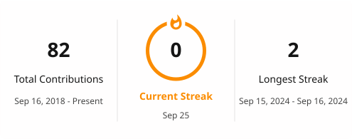

# 👋 Hola, soy Daniel Sosa

### 💻 Docente | Desarrollador de Software | Ingeniería en Computación

Apasionado por el desarrollo de software, la tecnología y la educación.

Me gusta transformar ideas y problemas reales en soluciones tecnológicas, combinando desarrollo web, aplicaciones móviles, bases de datos y nuevas tecnologías.

---

## 🚀 Sobre mí

- 👨‍💻 Desarrollador de Software
- 🎓 Ingeniero en Computación
- 👨‍🏫 Docente de Desarrollo de Software
- 🗄️ Diseño y administración de bases de datos
- 🌐 Desarrollo de aplicaciones web y APIs
- 📱 Desarrollo de aplicaciones móviles
- 🤖 Interesado en Inteligencia Artificial y tecnología educativa
- 🧩 Apasionado por resolver problemas mediante la tecnología

---

## 🛠️ Tecnologías y herramientas

### 💻 Lenguajes

### 🌐 Desarrollo Web

### 📱 Desarrollo móvil

### 🗄️ Bases de datos y Backend

### ⚙️ Herramientas

---

## 📂 Proyectos destacados

### 🛒 SosaStore

Aplicación web orientada al comercio electrónico y gestión de productos.

**Tecnologías:**  
`Next.js` `TypeScript` `React` `Supabase`

🔗 [Ver repositorio](https://github.com/93Cast/SosaStore)

---

### 📦 Sistema de Inventario

Sistema para la administración y control de inventario.

**Tecnologías:**  
`Java` `Spring Boot` `MySQL`

🔗 [Ver repositorio](https://github.com/93Cast/SistemaInventario)

---

### 🌐 CRUD Spring Example

Proyecto educativo para demostrar operaciones CRUD utilizando Spring.

**Tecnologías:**  
`Java` `Spring Boot` `Thymeleaf` `MySQL`

🔗 [Ver repositorio](https://github.com/93Cast/CRUDSpringExample)

---

### 🎮 PokeAPI

Aplicación que consume información de Pokémon mediante una API.

**Tecnologías:**  
`JavaScript` `REST API`

🔗 [Ver repositorio](https://github.com/93Cast/PokeApi)

---

### 📱 Anime App

Aplicación móvil desarrollada con Flutter que consume información de anime mediante una API externa.

**Tecnologías:**  
`Flutter` `Dart` `REST API`

---

### 🔐 Firebase Login

Aplicación móvil desarrollada con SwiftUI e integración con Firebase Authentication.

**Tecnologías:**  
`Swift` `SwiftUI` `Firebase`

---

## 🏆 Logros

🥈 **2.º lugar nacional** en categoría de Ingeniería — EUREKA

🏅 **4.º lugar** en la Copa de Programación de la ESEN

👨‍🏫 Experiencia en formación de estudiantes en desarrollo de software

🎓 Docencia universitaria en el área de análisis, diseño de sistemas y bases de datos

---

## 👨‍🏫 Docencia y tecnología

Una de mis principales áreas de interés es la integración de la tecnología en los procesos educativos.

Me interesa especialmente explorar cómo herramientas como la Inteligencia Artificial pueden utilizarse para mejorar la enseñanza, el aprendizaje y el desarrollo de software.

> **"La tecnología es una herramienta; la creatividad y la capacidad de resolver problemas son las que generan el verdadero impacto."**

---

# 📊 GitHub

### 📈 Estadísticas

### 💻 Lenguajes más utilizados

### 🔥 Actividad

---

## 📌 Mis repositorios

---

## 🌐 Conecta conmigo

---

💻 Desarrollado con pasión por la tecnología

⭐ Si alguno de mis proyectos te resulta interesante, ¡no dudes en darle una estrella!

